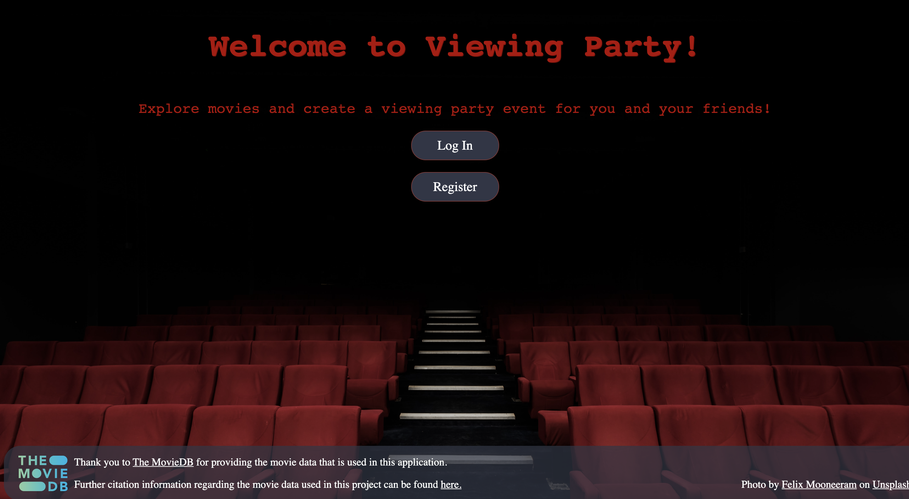

# Viewing Party

Viewing party is an application in which users can explore movie options and create a viewing party event for the user and friends. This was a 10 day project assigned by the Turing School of Software & Design Backend Engineering Program. If you'd like to see the live web app, check out [our site on Heroku](https://viewing-party-m3.herokuapp.com/)

## Contributors 

Gus Cunningham [GitHub](https://github.com/cunninghamge) | [LinkedIn](https://www.linkedin.com/in/grayson-cunningham/)

Saundra Catalina [GitHub](https://github.com/saundracatalina) | [LinkedIn](https://www.linkedin.com/in/saundra-catalina/)

Isabelle Villasenor [GitHub](https://github.com/isabellevillasenor) | [LinkedIn](https://www.linkedin.com/in/isabelle-villasenor/)

## Our Schema

# Local Setup
- If you're a dev wanting to see the code in your local enviroment follow the steps below!

1. Apply for an API key at [TheMovieDB](https://www.themoviedb.org/)
2. Clone the repo   
  `git clone https://github.com/your_username_/viewing_party.git`
3. Install gem packages  
  `bundle install`
4. Install Figaro  
  `bundle install figaro`
5. Enter API Key  
  `config/application.yml`
6. Setup the database   
  `rails db:{create, migrate}`
7. Run tests and open coverage report   
  `bundle exec rspec`  
  `open coverage/index.html` 
8. Run Rubocop  
  `rubocop`  

## Versions

- Ruby 2.5.3
- Rails 5.2.4.3

## Ideas for Additional Features
- Impliment styling with JavaScript
- Add chat functionality to viewing parties
- Create a navigation bar on all pages for users to log out or visit their dashboard
- Consume additonal API endpoints
